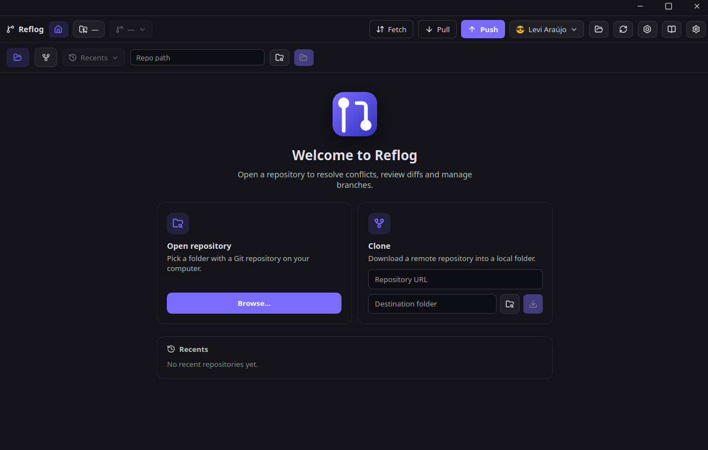

# Reflog



A modern desktop Git client built with **Tauri 2**, **React 19**, and **Rust** — focused on conflict resolution, history visualization, and workflow automations.

---

## 🏷️ Badges


---

## ✨ Features

| Category | Features |
| ---------- | ---------- |
| 📁 **Repository** | Open, clone, initialize, recent repos |
| 📦 **Staging** | Add, unstage, discard, commit, amend |
| 📊 **History** | Log, graph (DAG), blame, diff, reflog |
| ⚔️ **Conflicts** | Visual merge tool, cherry-pick, revert |
| 🔄 **Sync** | Push, pull, fetch, stash, submodules |
| 🌿 **Branches/Tags** | Create, delete, rename, merge, tag |
| ⚙️ **Automations** | Commit templates, hooks, recipes |
| 🛠️ **Settings** | Git config, identity, GPG, remotes |

---

## 🛠 Tech Stack

### Frontend

| Tech | Version | Purpose |
| ------ | --------- | --------- |
|  | 19 | UI library |
|  | 5 | Type safety |
|  | 6 | Build tool & dev server |
|  | 7 | Routing |
|  | 1 | Styling |
|  | 4 | Schema validation |
|  | - | Icons |
|  | 3 | Syntax highlighting |

### Backend (Rust/Tauri)

| Tech | Version | Purpose |
| ------ | --------- | --------- |
|  | 2 | Desktop framework |
|  | 2021 | Systems language |
| `tauri-plugin-fs` | 2 | File system access |
| `tauri-plugin-dialog` | 2 | Native dialogs |
| `tauri-plugin-cli` | 2 | CLI arguments |
| `serde` | 1 | Serialization |

---

## 📁 Project Structure

```
reflog/
├── doc/                    # Documentation
├── public/                 # Static assets
├── src/                    # Frontend (React + TypeScript)
│   ├── presentation/       # Presentation layer
│   │   ├── components/     # Reusable components
│   │   ├── pages/          # Pages/Routes
│   │   ├── layout/         # Layouts
│   │   ├── context/        # React Context providers
│   │   └── hooks/          # Custom hooks
│   ├── domain/             # Domain layer
│   │   └── entities/       # Business entities
│   ├── infrastructure/     # Infrastructure layer
│   ├── shared/             # Shared code
│   ├── routes.tsx          # Route configuration
│   └── main.tsx            # Entry point
├── src-tauri/              # Backend (Rust)
│   ├── src/
│   │   ├── commands/       # Tauri commands (API)
│   │   ├── domain/         # Rust domain
│   │   ├── runner.rs       # Git command execution
│   │   └── lib.rs          # Tauri entry point
│   ├── Cargo.toml
│   └── tauri.conf.json
├── tests/                  # E2E/Integration tests
├── package.json
├── tsconfig.json
├── vite.config.ts
└── biome.json              # Linter/Formatter
```

---

## ⚡ Quick Start

```bash
# Install dependencies
pnpm install

# Development (frontend + backend)
pnpm tauri dev

# Frontend only
pnpm dev        # Vite dev server
pnpm build      # TypeScript + Vite build

# Production build
pnpm tauri build
```

---

## 🧪 Commands

| Command | Description |
| --------- | ------------- |
| `pnpm dev` | Start Vite dev server |
| `pnpm build` | Type-check + build frontend |
| `pnpm tauri dev` | Run Tauri app with hot reload |
| `pnpm tauri build` | Build native binaries |
| `pnpm lint` | Run Biome linter |
| `pnpm lint:fix` | Auto-fix lint issues |
| `pnpm test` | Run Vitest unit tests |

---

## 📖 Documentation

- [🏗️ Frontend Architecture](./frontend.md) — React architecture, components, hooks, state
- [⚙️ Backend Architecture](./backend.md) — Rust/Tauri architecture, commands, GitRunner
- [📡 API Reference](./api.md) — Complete Tauri command reference with TypeScript types

---

## 🧰 Architecture Highlights

- **Clean Architecture** — Separation of presentation, domain, and infrastructure
- **Trait-based Rust backend** — `GitRunner` trait for testability (mock runner in tests)
- **Type-safe IPC** — Full TypeScript definitions for all Tauri commands
- **Blocking operations handled correctly** — `spawn_blocking` for Git commands
- **Security-first** — No shell injection, path validation, scoped FS access
- **Performance** — LTO, stripped binaries, lazy-loaded routes, virtualized lists

---

## 📄 License

MIT License — see [LICENSE](LICENSE) for details.

---

## 🤝 Contributing

PRs welcome! Please run `pnpm lint:fix` and `pnpm test` before submitting.
