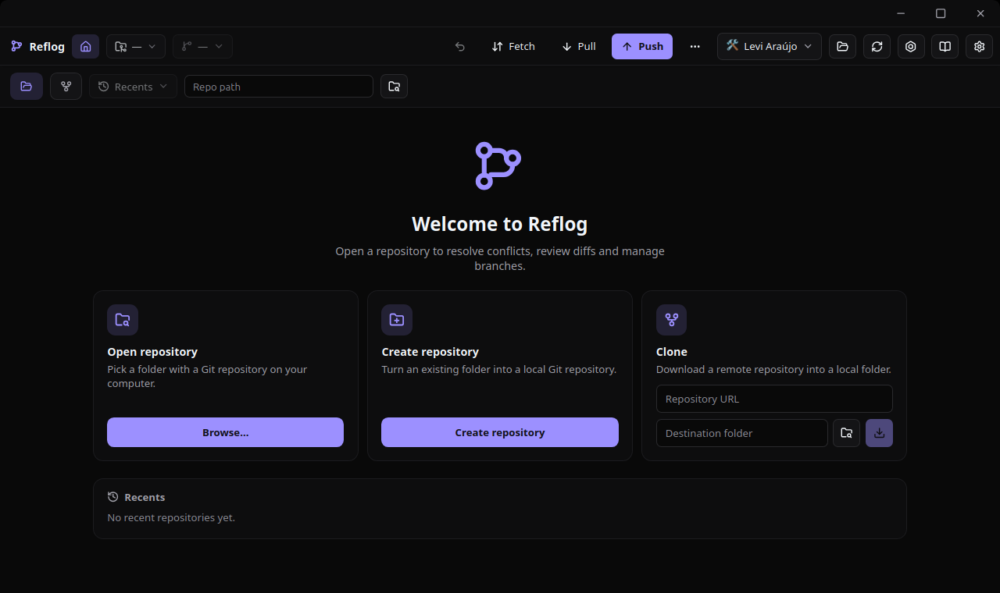

# Reflog



A modern desktop Git client built with **Tauri 2**, **React 19**, and **Rust** — focused on conflict resolution, history visualization, and workflow automations.

---

## 🏷️ Badges


---

## ✨ Features

| Category | Features |
| ---------- | ---------- |
| 📁 **Repository** | Open, clone, initialize, recents, superproject/submodule switcher |
| 📦 **Staging** | Add, unstage, discard (per file, per hunk, per selection), commit, amend |
| 📊 **History** | Log, graph (DAG), blame, diff, reflog, file history |
| 🔎 **Search** | Server-side `git log` filters: author, message, path, pickaxe, date range |
| 🔀 **Compare** | Merge base, per-file stats, ahead/behind commits, full diff between refs |
| ⚔️ **Conflicts** | Visual merge tool, cherry-pick, revert, interactive rebase |
| 🔄 **Sync** | Push, force-push (`--force-with-lease`), push tags, delete remote branch, pull, fetch (per remote, optional prune), upstream management, stash, submodules |
| 🌿 **Branches/Tags** | Create (from any ref), delete (with force), rename, merge, tag |
| ↩️ **Undo** | `Ctrl+Z` / `Ctrl+Shift+Z` over a bounded stack of reversible actions |
| ⚙️ **Automations** | Commit templates, recipes, monitors, quick actions |
| 🛠️ **Settings** | Git config editor (allow-listed keys), identity profiles, GPG status, remotes |

---

## 🛠 Tech Stack

### Frontend

| Tech | Version | Purpose |
| ------ | --------- | --------- |
|  | 19 | UI library |
|  | 7 | Type safety |
|  | 8 | Build tool & dev server |
|  | 7 | Routing |
|  | 1 | Styling |
|  | 4 | Schema validation |
|  | - | Icons |
|  | 3 | Syntax highlighting |

### Backend (Rust/Tauri)

| Tech | Version | Purpose |
| ------ | --------- | --------- |
|  | 2 | Desktop framework |
|  | 2021 | Systems language |
| `tauri-plugin-fs` | 2 | File system access |
| `tauri-plugin-dialog` | 2 | Native dialogs |
| `tauri-plugin-cli` | 2 | CLI arguments |
| `tauri-plugin-opener` | 2 | Open URLs/files with the default app |
| `serde` | 1 | Serialization |

---

## 📁 Project Structure

```txt
reflog/
├── .github/workflows/   # ci, release, landing (GitHub Pages)
├── doc/                 # Documentation
├── public/              # Static assets (icon, screenshots)
├── scripts/             # Version helpers (check-version.mjs, version.mjs)
├── src/                 # Frontend (React + TypeScript)
│   ├── presentation/    # Presentation layer
│   │   ├── cms/         # Integrated docs + AutomationHub content
│   │   ├── components/  # Reusable components
│   │   ├── pages/       # Pages/Routes
│   │   ├── layout/      # Layouts
│   │   ├── context/     # React Context providers
│   │   └── hooks/       # Custom hooks
│   ├── domain/          # Domain layer
│   │   └── entities/    # Business entities
│   ├── infrastructure/  # Infrastructure layer (git client, storage)
│   ├── data/            # Use-cases + protocols + singletons
│   ├── shared/          # Shared code
│   ├── message/         # i18n tables (en.json, pt.json)
│   ├── styles/          # Design tokens + global styles
│   ├── types/           # Shared TS types (mirror the Rust entities)
│   ├── i18n.ts
│   ├── routes.tsx       # Route configuration
│   └── main.tsx         # Entry point
├── src-tauri/           # Backend (Rust)
│   ├── src/
│   │   ├── commands/    # Tauri commands (API)
│   │   ├── domain/      # Rust domain
│   │   ├── runner.rs    # Git command execution
│   │   └── lib.rs       # Tauri entry point
│   ├── Cargo.toml
│   └── tauri.conf.json
├── tests/               # Vitest unit/component/hook tests
├── web/                 # Landing site (separate Vite app, own lockfile)
├── package.json
├── tsconfig.json
├── vite.config.ts
└── biome.json           # Linter/Formatter
```

The Tauri app and the landing site are two independent installs: `web/` has
its own `package.json` and `pnpm-lock.yaml` and is not part of a workspace.

---

## ⚡ Quick Start

### Prerequisites

| Tool | Version | Notes |
| ---- | ------- | ----- |
| Node.js | 24 (see `.nvmrc`) | `nvm use` — Vitest and the build require a current Node |
| pnpm | 10.16.1 | `corepack enable` or `npm i -g pnpm` |
| Rust | stable | via [rustup](https://rustup.rs) |
| Git | 2.x | Must be on `PATH` — the backend shells out to it |
| Tauri system deps | per OS | See [Tauri prerequisites](https://v2.tauri.app/start/prerequisites/) (WebKitGTK on Linux, etc.) |

```bash
# Install dependencies
pnpm install

# Development (frontend + backend)
pnpm tauri dev

# Frontend only
pnpm dev        # Vite dev server
pnpm build      # TypeScript + Vite build

# Production build
pnpm tauri build
```

## Open From Terminal

With the Reflog binary on your `PATH`, open the Git repository in the current directory with:

```bash
reflog .
```

---

## 📦 Build and Release

### System dependencies (Linux)

```bash
# Ubuntu / Debian / Linux Mint
sudo apt install -y libwebkit2gtk-4.1-dev librsvg2-dev libappindicator3-dev patchelf rpm
```

`rpm` is only needed for the RPM bundle, `patchelf` only for AppImage. The
`ci` backend job installs the first four; `release.yml` adds `rpm`, `xdg-utils`
and `libfuse2` on top.

### Local build

```bash
pnpm tauri build --bundles deb,appimage        # add ,rpm if you installed rpm
```

Artifacts land in `src-tauri/target/release/bundle/` (`.deb`, `.AppImage`, `.rpm`) and the
raw binary in `src-tauri/target/release/reflog`. `targets: "all"` in `tauri.conf.json` also
tries RPM and AppImage, so it fails without the packages above.

The Windows `.msi` cannot be produced on Linux — WiX runs on Windows only. Build it with CI
(`gh run download <run-id>`) or on a Windows machine with `pnpm tauri build`.

### CI

| Workflow | Trigger | What it does |
| -------- | ------- | ------------ |
| `.github/workflows/ci.yml` | push to `master`, PR, manual | actionlint on the workflow files; Biome + Vitest + `tsc --noEmit` + version check (frontend); landing typecheck/build (`web/`); `cargo test` (Linux) and `cargo check --all-targets` (Windows) |
| `.github/workflows/release.yml` | tag `v*`, manual | Biome, Vitest, `cargo test` and the version/tag check — **not** the full CI set: no actionlint, no `tsc --noEmit`, no landing build, and no Windows type-check job. Then AppImage + `.deb` + `.rpm` (ubuntu-22.04) and `-setup.exe` (windows-latest), attached to the GitHub Release |
| `.github/workflows/landing.yml` | push to `master` (landing paths), manual | builds `web/` and deploys it to GitHub Pages from `master` |

Because `release.yml` does not repeat every CI gate, let `ci` finish on the
same commit before tagging.

The `cargo check` on `windows-latest` exists because Windows-only breakage
never shows up anywhere else in the pipeline: both workflows run `cargo test` on
Linux only, so a construct that compiles everywhere except Windows — a
`#[cfg(not(windows))]` fallback, a platform-specific API — would otherwise
surface for the first time inside the release build, after the tag was pushed.

During the beta line Windows ships the NSIS installer only (`Reflog_<version>_windows_x64-setup.exe`).
The MSI bundler goes through WiX v3, whose `ProductVersion` is numeric-only, so it rejects a
prerelease version such as `0.1.0-beta.4` and would abort the whole build. The workflow adds `msi`
back automatically once the version has no prerelease suffix (`promote`), so the first stable
release gets both installers.

No macOS runner is configured, so no macOS artifact is published — the landing
page only advertises Linux and Windows.

If a bundler fails, the binaries that did get produced are still uploaded to the run page under
Artifacts (`bundles-ubuntu-22.04` / `bundles-windows-latest`) — the release upload is not the only
copy, so nothing is lost while debugging.

The `ci` workflow validates `.github/workflows/*.yml` with
[actionlint](https://github.com/rhysd/actionlint). A workflow file that GitHub cannot parse fails
instantly with zero jobs and no obvious error in the run page, so this catches that class of typo
(the usual one: double quotes inside an `if:` expression, which GitHub rejects — only single quotes
are valid string delimiters there) before it reaches a release tag.

### Versions (the app is in beta)

Reflog is pre-1.0 and ships as **prereleases**: the version carries a semver prerelease tag
(`0.1.0-beta.4` today) and the GitHub Release is flagged as *Pre-release*, so a beta never becomes
the "Latest" release by accident. The same version lives in `package.json`,
`src-tauri/Cargo.toml` and `src-tauri/tauri.conf.json`; CI refuses to build if they drift or
if the tag does not match.

```bash
node scripts/check-version.mjs            # validate + print version and suggested bumps
```

How the bumps work (the columns are examples, not the current version):

| From | Next beta | Promote to | Next stable |
| ---- | --------- | ---------- | ----------- |
| `0.1.0-beta.1` | `0.1.0-beta.2` | `0.1.0` | `0.1.1` (patch) / `0.2.0` (minor) |
| `0.1.0` | `0.1.0-beta.1` | — (`promote` needs a prerelease) | `0.1.1` / `0.2.0` |

```bash
# 1. set the next version in package.json, src-tauri/Cargo.toml and src-tauri/tauri.conf.json
#    (the landing badge in web/content/landing.ts follows the same number)
# 2. validate and commit
node scripts/check-version.mjs

# 3. tag with the exact version (CI fails on any mismatch)
git tag v0.1.0-beta.4 && git push origin master --tags

# download the artifacts of that run
gh run download
```

The release job needs `contents: write`; if it fails with `Resource not accessible by
integration`, enable *Read and write permissions* under Settings → Actions → Workflow
permissions. Releases are unsigned, so Windows SmartScreen warns on first run.

---

## 🧪 Commands

| Command | Description |
| --------- | ------------- |
| `pnpm dev` | Start Vite dev server |
| `pnpm build` | Type-check + build frontend |
| `pnpm preview` | Serve the built frontend |
| `pnpm tauri dev` | Run Tauri app with hot reload |
| `pnpm tauri build` | Build native binaries |
| `pnpm lint` | Run Biome linter over `src`, `tests`, `scripts`, `web` |
| `pnpm lint:fix` | Auto-fix lint issues |
| `pnpm test` | Run Vitest (unit, component and hook tests) |
| `pnpm test:e2e` | Run Playwright smoke tests for the landing site |
| `node scripts/check-version.mjs` | Validate the version across the three manifests |

The landing site is built from `web/` with its own scripts:

| Command | Description |
| --------- | ------------- |
| `cd web && pnpm dev` | Start the landing dev server |
| `cd web && pnpm build` | Type-check + build the landing site |
| `cargo test --manifest-path src-tauri/Cargo.toml` | Run the Rust tests |

---

## 📖 Documentation

- [Frontend Architecture](./doc/frontend.md) - React architecture, components, hooks, state
- [Backend Architecture](./doc/backend.md) - Rust/Tauri architecture, commands, GitRunner
- [API Reference](./doc/api.md) - Every Tauri command with its TypeScript signature

---

## 🧰 Architecture Highlights

- **Clean Architecture** — Separation of presentation, domain, and infrastructure
- **Trait-based Rust backend** — `GitRunner` trait for testability (mock runner in tests)
- **Type-safe IPC** — every registered Tauri command has a typed wrapper in
  `src/infrastructure/git/ipc-client.ts`, described by `IGitApi`, so hooks can be
  tested against an injected fake
- **Blocking operations handled correctly** — `spawn_blocking` for Git commands
- **Security-first** — No shell (argv arrays), `--` separators, input validators, config allowlist, output caps, timeouts, `--force-with-lease` instead of `--force`
- **Performance** — LTO, stripped binaries, lazy-loaded routes, paginated lists

---

## 📄 License

MIT License — see [LICENSE](LICENSE) for details.

---

## 🤝 Contributing

PRs welcome! Before submitting, run the same gates CI does:

```bash
pnpm lint:fix && pnpm test && pnpm exec tsc --noEmit
cargo test --manifest-path src-tauri/Cargo.toml
```

If you touch `web/`, also run `cd web && pnpm build`.
